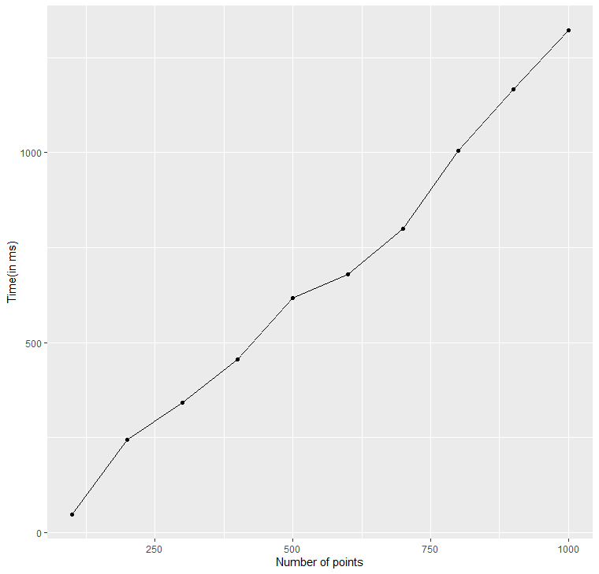
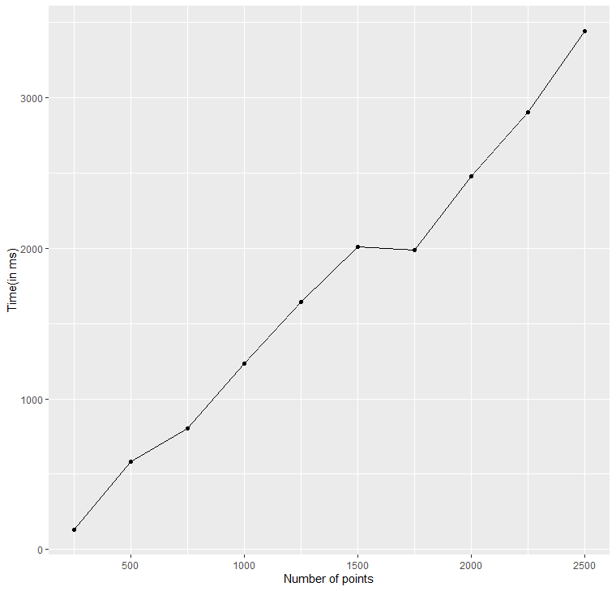
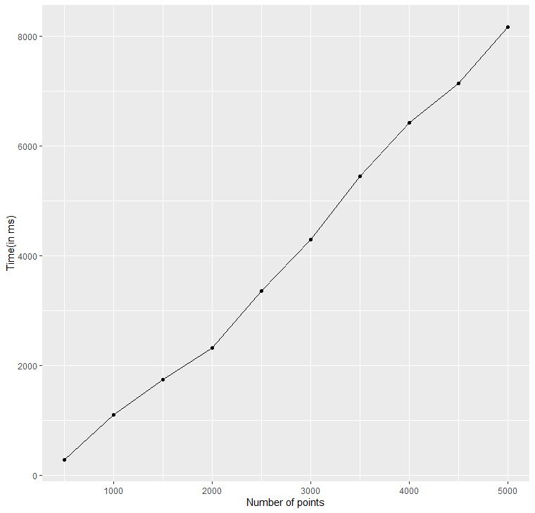
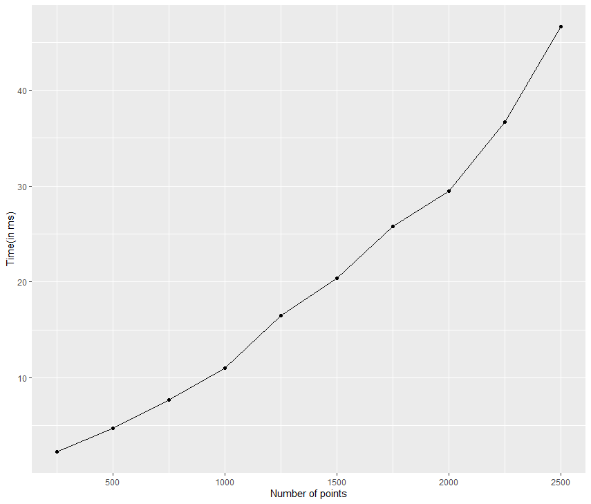
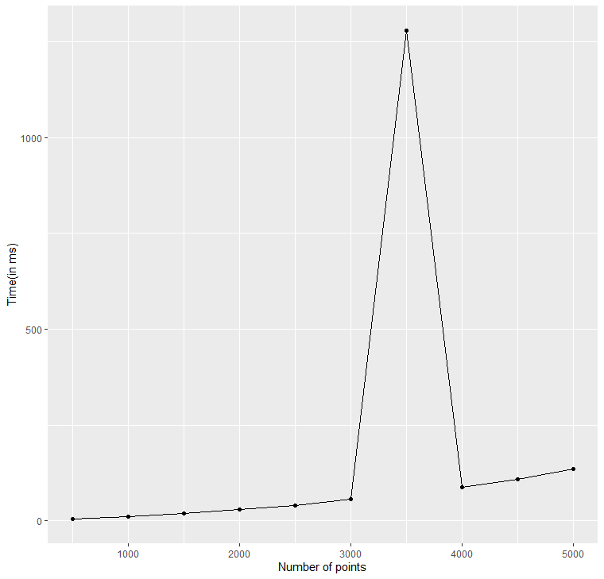
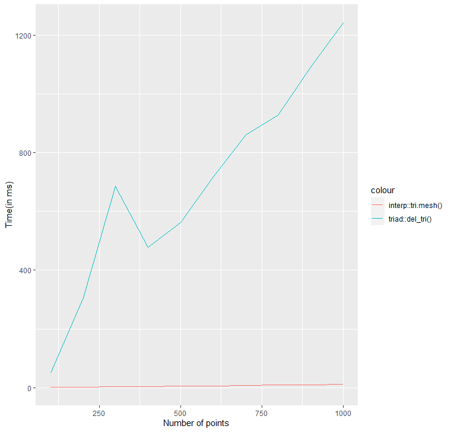
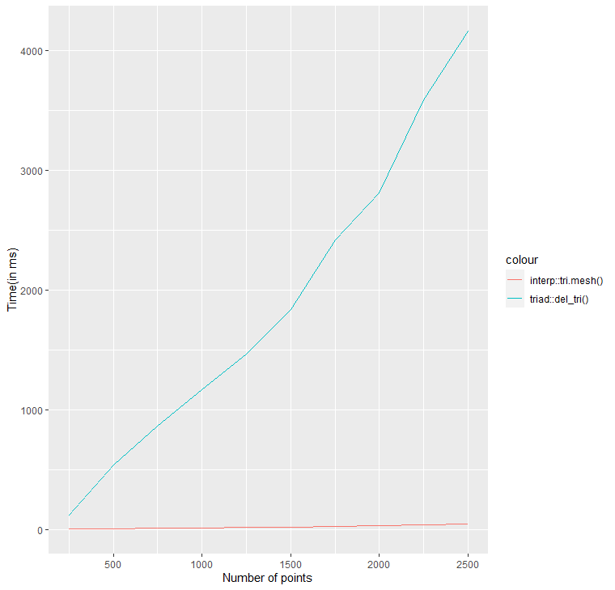
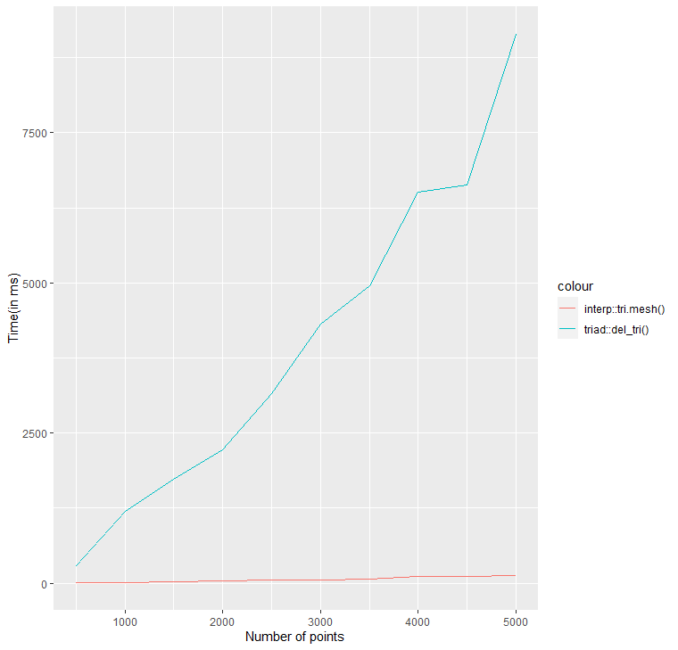

### Testing performance of ZeroDawn0D/tRiad package

#### Time v/s input size graph for del_tri() on a randomly generated set of points

Input size: 100 to 1000 points

Input size: 250 to 2500 points

Input size: 500 to 5000 points

#### Time v/s input size graph for interp::tri.mesh() on a randomly generated set of points

Input size: 250 to 2500 points

Input size: 500 to 5000 points

#### Time v/s input size comparison between two functions on a randomly generated set of points

Input size: 100 to 1000 points

Input size: 250 to 2500 points

Input size: 500 to 5000 points

